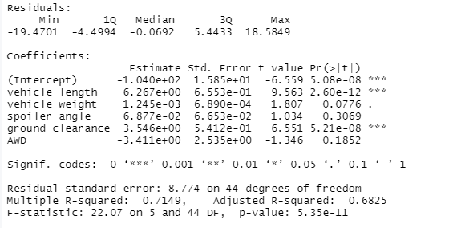
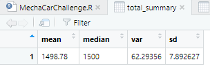
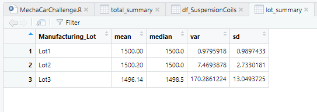

# MechaCar_Statistical_Analysis

## Linear Regression to Predict MPG

### Which variables/coefficients provided a non-random amount of variance to the mpg values in the dataset?
The lowest P values were generated by vehicle_length and ground_clearance. This indicates that they are statistically significant and are correlated to miles per gallon.

### Is the slope of the linear model considered to be zero? Why or why not?
Due to the model's extremely low P value (5.35e-11) we see that there is a statistical relationship within the data. This means that we must reject the null hypothesis, and the slope will not be 0.

### Does this linear model predict mpg of MechaCar prototypes effectively? Why or why not?
The R-squared value is 0.6825, indicating that this linear model will predict mpg just under 70% of the time. While this isn't foolproof, I would say it's effective. 

## Summary Statistics on Suspension Coils

The design specificatin for the suspension coils dictates that the variance of the suspension coils must not exceed 100 pounds per square inch. The total summary seems to indicate that the variance of all of the coils meets that threshhold, however when we break down the coils and analyze them by lot we see that lot 3's variance is many times higher than that of lot 1 and lot 2, and that lot 3 does *not* meet the specifications of the manufacturer.

## T-Tests on Suspension Coils

The first T-Test run on all of the Manufacturing Lots generated a P value of 0.05734 which shows that there is a statistical relationship. When we analyze this by lot, however, the P values of lots 1 and 2 were much higher than the significance level. This indicates that lot 1 and 2 are not statistically different from the overall population mean of 1500 PSI (see total summary table). Lot 3, however, which we had already flagged as having a high PSI variance, is statistically different than the overall population mean. This can also be seen in the lot summary table above.

## Study Design: MechaCar vs Competition

To get a better sense of MechaCar's performance, it is helpful to commpare it to similar makes and models made by other manufacturers.

### What metric or metrics are you going to test?

I believe the metrics that would be most valuable to consumers are: price, mileage, safety rating, and emissions. 

### What is the null hypothesis or alternative hypothesis?

The null hypothesis would mean that the two cars being compared are *not* statistically different in respect to price, mileage, safety rating, and emissions. Our alternate hypothesis would be that there are some statistical differences between similar makes and models of car, which would make a consumer choose one model over another. 

### What statistical test would you use to test the hypothesis? And why?

I would use a two sample T-Test as we are comparing two populations on the same statistic. It might also be helpful, as I am sure that there are multiple makes and models similar to MechaCar on the market, to run an ANOVA test to compare each of the cars directly.

### What data is needed to run the statistical test?

We would need sets of data for each make and model of car in each of the above listed metrics of interest where: each sample was randomly selected from the population data, where the input data is normally distributed, and where the variance of the input data should be similar. 
